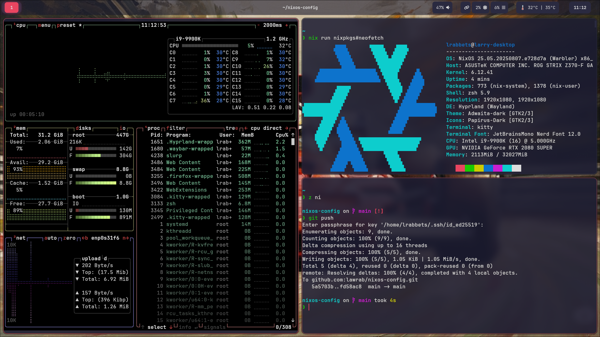

<div align="center">

# NixOS Configuration with Hyprland - A Declarative Desktop Journey

**Welcome to my personal NixOS and Linux customisation adventure!**

This repository is the living blueprint of my desktop, crafted with [NixOS](https://nixos.org/) and [Hyprland](https://hyprland.org/). It's a constantly evolving setup designed for a lightweight, keyboard-driven, and visually cohesive Wayland desktop experience with flakes, Home Manager, and comprehensive dotfiles.

</div>

<div align="center">

[](https://nixos.org/channels/nixos-unstable)
[](https://hyprland.org/)
[](https://nixos.wiki/wiki/Flakes)
[](https://github.com/nix-community/home-manager)

[](./LICENSE)
[](https://github.com/lawrab/nixos-config/commits/main)
[](https://github.com/lawrab/nixos-config)
[](https://github.com/lawrab/nixos-config/commits/main)

</div>

> **A Friendly Disclaimer:**  
> I'm a NixOS and Linux customisation enthusiast, not an expert. This setup is my learning playground and is guaranteed to contain experiments, quirks, and maybe even a few dragons. Please use it as inspiration, but always double-check before adopting anything critical for your own system!

---

## Table of Contents
- [What's Inside? A Look at the Tech Stack](#-whats-inside-a-look-at-the-tech-stack)
- [Blueprint: How It's All Organised](#️-blueprint-how-its-all-organised)
- [Configuration Documentation](#-configuration-documentation)
- [The Heart of the Look: Theming](#-the-heart-of-the-look-theming)
- [Using Unstable Packages](#-using-unstable-packages)
- [Secrets Management](#-secrets-management)
- [Installation Guide](#-installation-guide)
- [Troubleshooting & FAQ](#-troubleshooting--faq)
- [A Glimpse of the Desktop](#-a-glimpse-of-the-desktop)
- [Key Features & Topics](#-key-features--topics)
- [Acknowledgements](#-acknowledgements)
- [Licence](#-licence)

---

## ✨ What's Inside? NixOS Hyprland Tech Stack

This NixOS configuration brings together carefully chosen tools to create a seamless Wayland desktop environment optimised for developers and power users.

| Category          | Component                                                                                              |
| ----------------- | ------------------------------------------------------------------------------------------------------ |
| **Core System**   | **OS:** [NixOS](https://nixos.org/) (Unstable) │ **WM:** [Hyprland](./home/hyprland.nix) │ **Audio:** [PipeWire](https://pipewire.org/)          |
| **Visuals**       | **Bar:** [Waybar](./home/waybar.nix) │ **Lock Screen:** [Hyprlock](./hyprlock/hyprlock.nix) │ **Wallpaper:** [Hyprpaper](./hyprpaper/hyprpaper.nix) |
| **Terminal & Shell** | **Terminal:** [Kitty](./home/kitty.nix) │ **Shell:** [Zsh](./home/shell.nix) + [Oh My Zsh](https://ohmyz.sh/) │ **Prompt:** [Starship](https://starship.rs/) |
| **Tooling**       | **Launcher:** [Wofi](./home/wofi.nix) │ **Notifications:** [Mako](https://github.com/emersion/mako) │ **File Manager:** [Thunar](https://docs.xfce.org/xfce/thunar/start) |
| **Gaming & Apps** | **Gaming:** Steam, ProtonUp-Qt, Gamemode │ **Image Viewer:** [Loupe](https://gitlab.gnome.org/GNOME/loupe) │ **Passwords:** 1Password |

*...plus a custom [screenshot script](./home/scripts.nix), hand-picked fonts, and countless quality-of-life tweaks!*

---

## 🗺️ NixOS Configuration Structure & Organization

This flake-based NixOS configuration is designed with modularity and clarity in mind, making it easy for others to navigate, understand, and adapt.

```
.
├── flake.nix                # ❄️ Main flake entrypoint, defines inputs and outputs
├── home.nix                 # 🏠 Home Manager's main configuration file
├── configuration.nix        # ⚙️ Global system-wide settings
│
├── home/                    # 🧑‍💻 User-specific application configs (dotfiles)
│   ├── hyprland.nix         # ▸ Window manager rules and keybindings
│   ├── waybar.nix           # ▸ Status bar modules and styling
│   ├── kitty.nix            # ▸ Terminal appearance and settings
│   └── ...and many more
│
├── theme/
│   └── theme.nix            # 🎨 The heart of the look! Centralised colours and styles
│
├── secrets.nix              # 🔒 Optional: API keys and sensitive configuration (not committed)
│
└── screenshots/
    └── hyprland-layout.png  # 🖼️ A preview of the desktop
```

---

## 📚 Configuration Documentation

All configuration files include comprehensive inline documentation to help you understand NixOS-specific patterns and quirks. Key files are documented with:

### Core System Files
- **[`flake.nix`](./flake.nix)** - Main flake configuration with binary caches, channel mixing, and module organisation
- **[`configuration.nix`](./configuration.nix)** - System-wide settings including bootloader, networking, audio, graphics, and user management
- **[`home.nix`](./home.nix)** - Home Manager integration and module imports organisation

### Application Configurations
Each configuration file in the `home/` directory includes documentation for:
- NixOS-specific configuration patterns (e.g., `writeShellScriptBin`, service integration)
- Package naming quirks (underscores vs hyphens)
- Integration points between tools (MPRIS, D-Bus, XDG)
- Wayland-specific tool choices (Mako vs dunst, grim/slurp vs X11 tools)
- CSS styling in Nix configurations
- Self-referencing configuration patterns

The documentation focuses on **why** things are configured a certain way rather than just **what** each option does, making it easier for others to understand and adapt the configuration.

---

## 🎨 The Heart of the Look: Theming

All colours and style choices are managed in a single file: [`theme/theme.nix`](theme/theme.nix). This file is imported as a special argument into most modules, ensuring that everything from the window borders to the Waybar stays perfectly in sync. Change a colour once, and the whole desktop updates on the next rebuild.

---

## 📦 Using Unstable Packages

This configuration includes support for installing packages from both the stable NixOS channel (25.05) and the unstable channel. This gives you access to the latest versions of software while maintaining system stability.

### How It Works

The flake.nix defines two package sets:
- `pkgs` - Stable packages from NixOS 25.05
- `pkgs-unstable` - Latest packages from nixos-unstable

### When to Use Unstable Packages

Use unstable packages for:
- **New software** that isn't available in stable yet (like claude-code)
- **Development tools** that benefit from frequent updates
- **Applications** where you need the latest features or security patches

### Adding Unstable Packages

To add a package from unstable, use the `pkgs-unstable` prefix in your package lists:

```nix
# In home/packages.nix
home.packages = with pkgs; [
  # ... your stable packages
] ++ [
  # Packages from unstable
  pkgs-unstable.claude-code    # Latest Claude Code CLI
  pkgs-unstable.neovim         # Neovim with newest features
  pkgs-unstable.discord        # Discord with latest updates
  pkgs-unstable.vscode         # VS Code with latest extensions support
];
```

### Examples of Packages That Benefit from Unstable

- **claude-code** - AI coding assistant (currently only in unstable)
- **neovim** - Text editor with latest plugin compatibility
- **nodejs_22** - Latest Node.js runtime
- **firefox** - Browser with newest security patches
- **discord** - Chat app with latest features

### Safety Notes

- Mixing stable and unstable packages is generally safe
- Unstable packages may occasionally break during updates
- The system prioritises stability for core components while allowing flexibility for user applications

---

## 🔒 Secrets Management

This configuration includes support for managing sensitive information like API keys without committing them to the repository.

### How It Works

The configuration conditionally imports a `secrets.nix` file that contains sensitive data. If the file doesn't exist, the system builds normally without the secrets.

### Setting Up Secrets

1. **Create a `secrets.nix` file in the root directory:**

```nix
# secrets.nix
{
  anthropic_api_key = "your-actual-api-key-here";
  # Add more secrets as needed
}
```

2. **Set secure permissions:**

```bash
chmod 600 secrets.nix
```

3. **The secrets are automatically loaded** as environment variables when you rebuild your system.

### Supported Secrets

Currently, the configuration supports:
- `ANTHROPIC_API_KEY` - For Claude AI integration

### Security Notes

- The `secrets.nix` file is automatically ignored by Git (see `.gitignore`)
- Secrets are loaded as environment variables available system-wide
- If you don't need secrets, simply don't create the file - everything will work fine
- Use the provided `secrets.nix.example` as a template

---

## 🚀 Installation Guide

Ready to give it a try? Here's how you can get this setup running.

> **Prerequisite:** A running NixOS system with flakes enabled.

### ⚠️ A Note on Build Times

This configuration includes an *optional* setup for the [Ollama](https://ollama.com/) service to run large language models locally.

**Warning:** Building the system with Ollama enabled will trigger a **very long build time** (potentially an hour) for the first installation. This is because it needs to compile the entire CUDA toolkit from source if a pre-built binary is not available for your system.

#### How to Disable Ollama

If you do not want to build with Ollama, you can disable it with a one-line change.

1.  Open the `configuration.nix` file.
2.  Find the `imports` section at the top of the file.
3.  Add a `#` to the beginning of the `./ollama.nix` line to comment it out, like so:

    ```nix
    imports = [
      ./hardware-configuration.nix
      ./environment.nix
      ./home.nix
    
      # --- Optional Services ---
      # Uncomment the line below to enable the Ollama service.
      # Be aware: this will trigger a very long build the first time.
      # ./ollama.nix 
    ];
    ```
4.  Save the file and rebuild your system as normal.

### Step 1: Clone the Repository

```bash
git clone https://github.com/lawrab/nixos-config.git ~/nixos-config
cd ~/nixos-config
```

### Step 2: Update the Hostname

My configuration is set up for a machine with the hostname `larry-desktop`. You'll need to change this to match your own.

1.  **Find your hostname:** Run `hostname` in your terminal.
2.  **Update the flake:** Open `flake.nix` and change `"larry-desktop"` to your hostname.

### Step 3: Set Up Secrets (Optional)

If you want to use features that require API keys:

1. **Copy the example secrets file:**
   ```bash
   cp secrets.nix.example secrets.nix
   ```

2. **Edit the secrets file with your actual values:**
   ```bash
   nano secrets.nix  # or your preferred editor
   ```

3. **Secure the file:**
   ```bash
   chmod 600 secrets.nix
   ```

> **Note:** This step is completely optional. The system will build and work perfectly without any secrets configured.

### Step 4: Rebuild the System

There are two ways to apply this configuration:

#### Method A: The Symlink Approach (Recommended)

This is the most convenient method for managing your system config. It makes your cloned folder the direct source of truth for NixOS.

1.  **Back up your current config:**
    ```bash
    sudo mv /etc/nixos /etc/nixos.bak
    ```
2.  **Create a symbolic link:**
    ```bash
    sudo ln -s ~/nixos-config /etc/nixos
    ```
3.  **Rebuild your system:**
    ```bash
    sudo nixos-rebuild switch
    ```

#### Method B: The Pure Flake Approach

This method is great if you don't want to touch `/etc/nixos` and prefer to specify the path every time.

```bash
sudo nixos-rebuild switch --flake ~/nixos-config#your-hostname
```

### Step 5: Automatic Maintenance (Optional Setup)

Your system is now configured with automatic maintenance features:

- **🗑️ Garbage Collection**: Runs weekly (Sundays at 03:15) and aggressively keeps only the last 3 generations
- **🔄 System Updates**: Daily updates (04:30 ±30min) pull the latest configuration from your GitHub repository
- **🛠️ Store Optimization**: Automatically deduplicates files to save disk space

**Important Notes:**
- Updates will only apply if your PC is on at the scheduled times, otherwise they'll run at next boot
- No automatic reboots - you'll need to manually restart for kernel updates
- Manual cleanup: `sudo nix-collect-garbage -d` (system) and `nix-collect-garbage -d` (home-manager)

---

## ❔ Troubleshooting & FAQ

### Common Issues

-   **"flakes are not enabled" error:** If you get this error, you need to enable flakes in your `configuration.nix`. Add the following to your system configuration:
    ```nix
    nix.settings.experimental-features = [ "nix-command" "flakes" ];
    ```
-   **`nixos-rebuild` fails:** The build can fail for many reasons. Carefully read the error output, as it often points to the exact problem.

### Secrets-Related Issues

-   **Environment variables not available:** Make sure you've rebuilt your system after creating `secrets.nix`. Log out and back in to ensure environment variables are loaded.
-   **Secrets file not found warning:** This is normal if you haven't created a `secrets.nix` file. The system will work fine without it.
-   **Permission denied on secrets.nix:** Run `chmod 600 secrets.nix` to fix file permissions.

### Files You Can Safely Modify

- `secrets.nix` - Your personal secrets (never committed)
- `wallpapers/` - Add your own wallpapers here
- `theme/theme.nix` - Customise colours and styling
- Any configuration in `home/` - Tweak application settings

### Files You Should Be Careful With

- `hardware-configuration.nix` - Generated by NixOS, specific to your hardware
- `flake.lock` - Manages dependency versions, let Nix handle this

---

## 📸 A Glimpse of the Desktop



---

## 🎯 Key Features & Topics

This NixOS configuration showcases:

### Core Technologies
- **Declarative System Management** - NixOS with flakes for reproducible builds
- **Modern Window Manager** - Hyprland Wayland compositor with advanced features
- **Home Manager Integration** - Comprehensive dotfiles and user configuration management
- **Mixed Package Sources** - Stable and unstable channel support for latest software

### Desktop Environment Features
- **Wayland-Native Tools** - Modern alternatives: Waybar, Mako notifications, Wofi launcher
- **Consistent Theming** - Centralised colour scheme across all applications
- **Keyboard-Driven Workflow** - Optimised for productivity and minimal mouse usage
- **Gaming Ready** - Steam, ProtonUp-Qt, and performance optimisations included

### Developer-Friendly
- **Comprehensive Documentation** - Inline comments explaining NixOS patterns and quirks
- **Modular Architecture** - Easy to understand, modify, and extend configuration
- **Secret Management** - Secure handling of API keys and sensitive configuration
- **Build Optimization** - Binary cache configuration for faster rebuilds
- **Automatic Maintenance** - Weekly garbage collection and daily system updates keep the system clean and current

Perfect for developers, Linux enthusiasts, and anyone interested in modern declarative system configuration with Wayland desktop environments.

### GitHub Topics
`nixos` `hyprland` `wayland` `flakes` `home-manager` `linux-desktop` `dotfiles` `declarative-configuration` `wayland-compositor` `nix-flakes` `desktop-environment` `linux-customisation` `system-configuration` `waybar` `kitty-terminal` `developer-tools`

---

## 🙏 Acknowledgements

This configuration wouldn't exist without the incredible work and documentation from the community. Huge thanks to:
- The [NixOS Wiki](https://nixos.wiki/) and its contributors
- The [Hyprland Wiki](https://wiki.hyprland.org/)
- The passionate NixOS, Hyprland, and Linux communities on Reddit, Discord, and beyond.

---

## 📜 Licence

This configuration is released under the [MIT Licence](./LICENSE). Feel free to fork, adapt, and learn from it, but please do so at your own risk!

<div align="center">

**Happy Hacking!**

</div>