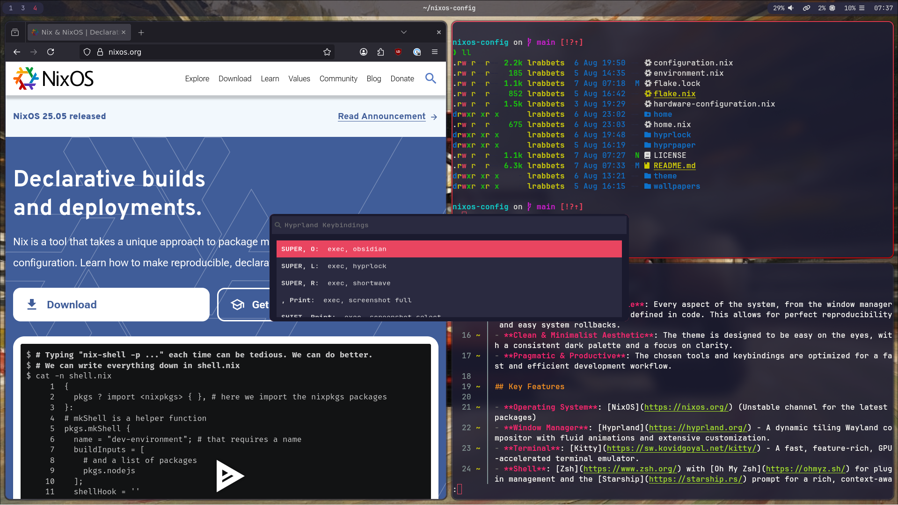

<div align="center">

# NixOS & Hyprland: A Declarative Desktop Journey

**Welcome to my personal NixOS and Linux customisation adventure!**

This repository is the living blueprint of my desktop, crafted with [NixOS](https://nixos.org/) and [Hyprland](https://hyprland.org/). It's a constantly evolving setup designed for a lightweight, keyboard-driven, and visually cohesive experience.

</div>

<div align="center">

[](https://nixos.org/channels/nixos-unstable)
[](https://hyprland.org/)
[](https://nixos.wiki/wiki/Flakes)
[](https://github.com/nix-community/home-manager)

[](./LICENSE)
[](https://github.com/lawrab/nixos-config/commits/main)
[](https://github.com/lawrab/nixos-config)
[](https://github.com/lawrab/nixos-config/commits/main)

</div>

> **A Friendly Disclaimer:**  
> I’m a NixOS and Linux customisation enthusiast, not an expert. This setup is my learning playground and is guaranteed to contain experiments, quirks, and maybe even a few dragons. Please use it as inspiration, but always double-check before adopting anything critical for your own system!

---

## Table of Contents
- [What’s Inside? A Look at the Tech Stack](#-whats-inside-a-look-at-the-tech-stack)
- [Blueprint: How It's All Organised](#️-blueprint-how-its-all-organised)
- [The Heart of the Look: Theming](#-the-heart-of-the-look-theming)
- [Installation Guide](#-installation-guide)
- [Troubleshooting & FAQ](#-troubleshooting--faq)
- [A Glimpse of the Desktop](#-a-glimpse-of-the-desktop)
- [Acknowledgements](#-acknowledgements)
- [Licence](#-licence)

---

## ✨ What’s Inside? A Look at the Tech Stack

This configuration brings together some of my favourite tools to create a seamless Wayland environment.

| Category          | Component                                                                                              |
| ----------------- | ------------------------------------------------------------------------------------------------------ |
| **Core System**   | **OS:** [NixOS](https://nixos.org/) (Unstable) │ **WM:** [Hyprland](./home/hyprland.nix) │ **Audio:** [PipeWire](https://pipewire.org/)          |
| **Visuals**       | **Bar:** [Waybar](./home/waybar.nix) │ **Lock Screen:** [Hyprlock](./hyprlock/hyprlock.nix) │ **Wallpaper:** [Hyprpaper](./hyprpaper/hyprpaper.nix) |
| **Terminal & Shell** | **Terminal:** [Kitty](./home/kitty.nix) │ **Shell:** [Zsh](./home/shell.nix) + [Oh My Zsh](https://ohmyz.sh/) │ **Prompt:** [Starship](https://starship.rs/) |
| **Tooling**       | **Launcher:** [Wofi](./home/wofi.nix) │ **Notifications:** [Mako](https://github.com/emersion/mako) │ **File Manager:** [Thunar](https://docs.xfce.org/xfce/thunar/start) |
| **Gaming & Apps** | **Gaming:** Steam, ProtonUp-Qt, Gamemode │ **Image Viewer:** [Loupe](https://gitlab.gnome.org/GNOME/loupe) │ **Passwords:** 1Password |

*...plus a custom [screenshot script](./home/scripts.nix), hand-picked fonts, and countless quality-of-life tweaks!*

---

## 🗺️ Blueprint: How It's All Organised

This flake-based configuration is designed to be modular and easy to navigate.

```
.
├── flake.nix                # ❄️ Main flake entrypoint, defines inputs and outputs
├── home.nix                 # 🏠 Home Manager's main configuration file
├── configuration.nix        # ⚙️ Global system-wide settings
│
├── home/                    # 🧑‍💻 User-specific application configs (dotfiles)
│   ├── hyprland.nix         # ▸ Window manager rules and keybindings
│   ├── waybar.nix           # ▸ Status bar modules and styling
│   ├── kitty.nix            # ▸ Terminal appearance and settings
│   └── ...and many more
│
├── theme/
│   └── theme.nix            # 🎨 The heart of the look! Centralised colours and styles
│
└── screenshots/
    └── hyprlan-layout.png   # 🖼️ A preview of the desktop
```

---

## 🎨 The Heart of the Look: Theming

All colours and style choices are managed in a single file: [`theme/theme.nix`](theme/theme.nix). This file is imported as a special argument into most modules, ensuring that everything from the window borders to the Waybar stays perfectly in sync. Change a colour once, and the whole desktop updates on the next rebuild.

---

## 🚀 Installation Guide

Ready to give it a try? Here’s how you can get this setup running.

> **Prerequisite:** A running NixOS system with flakes enabled.

### Step 1: Clone the Repository

```bash
git clone https://github.com/lawrab/nixos-config.git ~/nixos-config
```

### Step 2: Update the Hostname

My configuration is set up for a machine with the hostname `larry-desktop`. You'll need to change this to match your own.

1.  **Find your hostname:** Run `hostname` in your terminal.
2.  **Update the flake:** Open `flake.nix` and change `"larry-desktop"` to your hostname.

### Step 3: Rebuild the System

There are two ways to apply this configuration:

#### Method A: The Symlink Approach (Recommended)

This is the most convenient method for managing your system config. It makes your cloned folder the direct source of truth for NixOS.

1.  **Back up your current config:**
    ```bash
    sudo mv /etc/nixos /etc/nixos.bak
    ```
2.  **Create a symbolic link:**
    ```bash
    sudo ln -s ~/nixos-config /etc/nixos
    ```
3.  **Rebuild your system:**
    ```bash
    sudo nixos-rebuild switch
    ```

#### Method B: The Pure Flake Approach

This method is great if you don't want to touch `/etc/nixos` and prefer to specify the path every time.

```bash
sudo nixos-rebuild switch --flake ~/nixos-config#your-hostname
```

---

## ❔ Troubleshooting & FAQ

-   **"flakes are not enabled" error:** If you get this error, you need to enable flakes in your `configuration.nix`. Add the following to your system configuration:
    ```nix
    nix.settings.experimental-features = [ "nix-command" "flakes" ];
    ```
-   **`nixos-rebuild` fails:** The build can fail for many reasons. Carefully read the error output, as it often points to the exact problem. 
---

## 📸 A Glimpse of the Desktop



---

## 🙏 Acknowledgements

This configuration wouldn't exist without the incredible work and documentation from the community. Huge thanks to:
- The [NixOS Wiki](https://nixos.wiki/) and its contributors
- The [Hyprland Wiki](https://wiki.hyprland.org/)
- The passionate NixOS, Hyprland, and Linux communities on Reddit, Discord, and beyond.

---

## 📜 Licence

This configuration is released under the [MIT Licence](./LICENSE). Feel free to fork, adapt, and learn from it, but please do so at your own risk!

<div align="center">

**Happy Hacking!**

</div>
