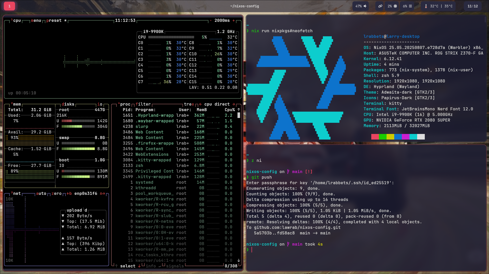

<div align="center">

# NixOS Configuration with Hyprland - A Declarative Desktop Journey

⚠️ **GPU Undervolting Warning**: This configuration includes GPU undervolting settings that automatically limit the NVIDIA GPU clock speed to 1905 MHz. This is configured for a specific hardware setup and may not be suitable for all systems. See the [GPU Configuration section](#-gpu-configuration--undervolting) below for instructions on how to disable or modify this setting.

**Welcome to my personal NixOS and Linux customisation adventure!**

This repository is the living blueprint of my desktop, crafted with [NixOS](https://nixos.org/) and [Hyprland](https://hyprland.org/). It's a constantly evolving setup designed for a lightweight, keyboard-driven, and visually cohesive Wayland desktop experience with flakes, Home Manager, and comprehensive dotfiles.

</div>

<div align="center">

[](https://nixos.org/channels/nixos-unstable)
[](https://hyprland.org/)
[](https://nixos.wiki/wiki/Flakes)
[](https://github.com/nix-community/home-manager)
[](https://catppuccin.com/)

[](./LICENSE)
[](https://github.com/lawrab/nixos-config/commits/main)
[](https://github.com/lawrab/nixos-config)
[](https://github.com/lawrab/nixos-config/commits/main)

</div>

> **A Friendly Disclaimer:**  
> I'm a NixOS and Linux customisation enthusiast, not an expert. This setup is my learning playground and is guaranteed to contain experiments, quirks, and maybe even a few dragons. Please use it as inspiration, but always double-check before adopting anything critical for your own system!

---

## Table of Contents
- [What's Inside? A Look at the Tech Stack](#-whats-inside-a-look-at-the-tech-stack)
- [Blueprint: How It's All Organised](#️-blueprint-how-its-all-organised)
- [Phase 2: Project-Based Development Workflow](#-phase-2-project-based-development-workflow)
- [Configuration Documentation](#-configuration-documentation)
- [The Heart of the Look: Theming](#-the-heart-of-the-look-theming)
- [Using Unstable Packages](#-using-unstable-packages)
- [Secrets Management](#-secrets-management)
- [Network Storage Configuration](#-network-storage-configuration)
- [Audio Pipeline & Noise Suppression](#️-audio-pipeline--noise-suppression)
- [GPU Configuration & Undervolting](#-gpu-configuration--undervolting)
- [Installation Guide](#-installation-guide)
- [Troubleshooting & FAQ](#-troubleshooting--faq)
- [A Glimpse of the Desktop](#-a-glimpse-of-the-desktop)
- [Key Features & Topics](#-key-features--topics)
- [Acknowledgements](#-acknowledgements)
- [Licence](#-licence)

---

## ✨ What's Inside? NixOS Hyprland Tech Stack

This NixOS configuration brings together carefully chosen tools to create a seamless Wayland desktop environment optimised for developers and power users.

| Category          | Component                                                                                              |
| ----------------- | ------------------------------------------------------------------------------------------------------ |
| **Core System**   | **OS:** [NixOS](https://nixos.org/) (Unstable) │ **WM:** [Hyprland](./home/hyprland.nix) │ **Audio:** [PipeWire](https://pipewire.org/)          |
| **Visuals**       | **Bar:** [Waybar](./home/waybar.nix) │ **Lock Screen:** [Hyprlock](./hyprlock/hyprlock.nix) │ **Wallpaper:** [swww](./swww/swww.nix) |
| **Terminal & Shell** | **Terminal:** [Kitty](./home/kitty.nix) │ **Shell:** [Zsh](./home/shell.nix) + [Oh My Zsh](https://ohmyz.sh/) │ **Prompt:** [Starship](https://starship.rs/) |
| **Tooling**       | **Launcher:** [Wofi](./home/wofi.nix) │ **Notifications:** [Mako](https://github.com/emersion/mako) │ **File Manager:** [Thunar](https://docs.xfce.org/xfce/thunar/start) |
| **Gaming & Apps** | **Gaming:** Steam, ProtonUp-Qt, Gamemode │ **Image Viewer:** [Loupe](https://gitlab.gnome.org/GNOME/loupe) │ **Passwords:** 1Password |
| **Audio** | **Noise Suppression:** [DeepFilterNet](https://github.com/Rikorose/DeepFilterNet) (PipeWire filter-chain) │ **Editing:** [Audacity](https://www.audacityteam.org/) │ **Conversion:** FFmpeg, SoX │ **Playback:** VLC |

*...plus a custom [screenshot script](./home/scripts.nix), hand-picked fonts, and countless quality-of-life tweaks!*

---

## 🗺️ NixOS Configuration Structure & Organization

This flake-based NixOS configuration is designed with modularity and clarity in mind, making it easy for others to navigate, understand, and adapt.

```
.
├── flake.nix                # ❄️ Main flake entrypoint, defines inputs and outputs
├── configuration.nix        # ⚙️ System-wide settings and module imports
├── home.nix                 # 🏠 Home Manager integration and user module imports
├── system-packages.nix      # 📦 System-wide packages (nfs-utils, cifs-utils, etc.)
├── mounts.nix               # 💾 Network filesystem mounts (NFS/SMB shares)
├── ollama.nix               # 🤖 Local AI model server configuration (disabled by default)
│
├── home/                    # 🧑‍💻 User-specific application configs (dotfiles)
│   ├── browsers.nix         # 🌐 Firefox & Brave browser configuration
│   ├── hyprland.nix         # 🪟 Window manager rules and keybindings
│   ├── waybar.nix           # 📊 Status bar modules and styling
│   ├── packages.nix         # 📦 Essential system packages (lightweight)
│   ├── direnv.nix           # 🔄 Development environment management
│   ├── cli-tools.nix        # 🎨 Catppuccin theming for CLI tools
│   ├── environment.nix      # 🔧 Environment variables and shell setup
│   ├── shell.nix            # 🐚 Zsh configuration and aliases
│   ├── gtk.nix              # 🎨 GTK theming with consolidated CSS
│   ├── scripts.nix          # 📜 Custom shell scripts and utilities
│   ├── vscode.nix           # 💻 VSCode with direnv integration
│   └── ...and more application configs
│
├── dev-templates/           # 🚀 Project-specific development environments
│   ├── python-ml/           # 🐍 Machine learning environment
│   ├── python-web/          # 🌐 Web development environment
│   └── nodejs/              # ⚡ Node.js development environment
│
├── theme/
│   └── theme.nix            # 🎨 Fallback colors for non-Catppuccin apps
│
└── screenshots/
    └── hyprland-layout.png  # 🖼️ Desktop preview
```

---

## 🚀 Phase 2: Project-Based Development Workflow

This configuration implements a **Phase 2** approach to NixOS development environments, moving from system-wide package installation to project-specific, reproducible development environments using Nix flakes and direnv.

### Why Phase 2?

**Traditional Approach (Phase 1):**
- ❌ Heavy system-wide package installation (67+ Python packages)
- ❌ Slow system rebuilds due to compilation
- ❌ Version conflicts between projects
- ❌ Difficult to share exact development environments

**Phase 2 Approach:**
- ✅ **~80% faster system rebuilds** - only essential tools installed globally
- ✅ **Project isolation** - each project has its own environment
- ✅ **Reproducible environments** - exact dependencies defined per project
- ✅ **Instant environment switching** - automatic loading via direnv
- ✅ **Shareable setups** - teammates get identical environments

### How It Works

#### 1. Lightweight System Configuration
The system now only includes essential development tools globally:
```nix
# Only essential tools installed system-wide
claude-code        # AI coding assistant
uv                 # Python package manager
python3            # Base Python interpreter
```

All heavy development packages (numpy, pandas, nodejs, etc.) have been moved to project-specific flakes.

#### 2. Development Templates
Pre-configured development environments for common use cases:

| Template | Use Case | Included Packages |
|----------|----------|-------------------|
| **python-ml** | Machine Learning | numpy, pandas, scikit-learn, matplotlib, jupyter, opencv |
| **python-web** | Web Development | flask, django, fastapi, sqlalchemy, postgresql, redis |
| **nodejs** | JavaScript/TypeScript | nodejs, typescript, vite, eslint, prettier, jest |

#### 3. The `dev-init` Workflow

**Quick Start:**
```bash
# Create a new project
mkdir my-ml-project && cd my-ml-project

# Initialize with template
dev-init python-ml

# Environment automatically loads!
# You now have access to all ML packages
python -c "import numpy; print('NumPy ready!')"
```

**What happens behind the scenes:**
1. `dev-init` copies the appropriate `flake.nix` template
2. Creates `.envrc` file for direnv integration
3. Automatically allows direnv to load the environment
4. Environment becomes active immediately

#### 4. Automatic Environment Management

**Direnv Integration:**
- **Automatic loading**: Environment activates when entering project directory
- **Automatic unloading**: Environment deactivates when leaving project
- **VSCode integration**: Automatic environment detection in editor
- **Shell integration**: Works seamlessly with bash/zsh

**Example Workflow:**
```bash
# Navigate to project - environment loads automatically
cd ~/projects/my-ml-project
# → 🐍 Python ML environment loaded
# → Python: 3.12.x
# → Available packages: numpy, pandas, scikit-learn...

# Start coding immediately
jupyter lab
# All packages available, no installation needed

# Leave project - environment unloads automatically
cd ~/
# → Environment deactivated
```

#### 5. VSCode Integration

The configuration includes automatic VSCode integration:
- **Direnv extension**: Automatic environment detection
- **Enhanced Nix support**: Syntax highlighting and language server
- **Python integration**: Automatic virtual environment detection
- **Settings sync**: Consistent settings across all development environments

### Creating Custom Templates

**Add your own development environment:**

1. **Create template directory:**
   ```bash
   mkdir ~/nixos-config/dev-templates/my-template
   ```

2. **Create flake.nix:**
   ```nix
   {
     description = "My Custom Development Environment";
     
     inputs = {
       nixpkgs.url = "github:nixos/nixpkgs/nixos-unstable";
       flake-utils.url = "github:numtide/flake-utils";
     };

     outputs = { nixpkgs, flake-utils, ... }:
       flake-utils.lib.eachDefaultSystem (system:
         let pkgs = nixpkgs.legacyPackages.${system};
         in {
           devShells.default = pkgs.mkShell {
             buildInputs = with pkgs; [
               # Your packages here
             ];
             
             shellHook = ''
               echo "🚀 My custom environment loaded"
               # Your initialization commands
             '';
           };
         });
   }
   ```

3. **Use your template:**
   ```bash
   dev-init my-template
   ```

### Advanced Usage

**Manual Environment Management:**
```bash
# Enter environment manually
nix develop

# Check what's available
which python
pip list

# Exit environment
exit
```

**Environment Customization:**
```bash
# Edit project-specific packages
nano flake.nix

# Reload environment
direnv reload
```

**Sharing Environments:**
```bash
# Share flake.nix with teammates
git add flake.nix .envrc
git commit -m "Add development environment"

# Teammates get identical environment
git clone project && cd project
# Environment automatically loads with exact same packages
```

### Migration Guide

**For existing projects:**

1. **Backup current setup:**
   ```bash
   pip freeze > requirements.txt  # Save current packages
   ```

2. **Initialize development environment:**
   ```bash
   dev-init python-ml  # or appropriate template
   ```

3. **Customize as needed:**
   ```bash
   nano flake.nix  # Add any missing packages
   direnv reload   # Apply changes
   ```

4. **Verify environment:**
   ```bash
   python -c "import your_packages"  # Test imports
   ```

This Phase 2 approach transforms your system from a "development workstation" to a "development platform" - cleaner, faster, and infinitely more maintainable!

---

## 📚 Configuration Documentation

All configuration files include comprehensive inline documentation to help you understand NixOS-specific patterns and quirks. Key files are documented with:

### Core System Files
- **[`flake.nix`](./flake.nix)** - Main flake configuration with binary caches, channel mixing, and module organisation
- **[`configuration.nix`](./configuration.nix)** - System-wide settings including bootloader, networking, audio, graphics, and user management
- **[`home.nix`](./home.nix)** - Home Manager integration and user module imports

### Key User Configuration Files
- **[`home/browsers.nix`](./home/browsers.nix)** - Consolidated Firefox and Brave configuration with matching settings
- **[`home/packages.nix`](./home/packages.nix)** - User packages organized by category (utilities, development, gaming, etc.)
- **[`home/environment.nix`](./home/environment.nix)** - Environment variables for Wayland compatibility and dark mode
- **[`home/shell.nix`](./home/shell.nix)** - Zsh configuration with Oh My Zsh, aliases, and shell integrations
- **[`home/gtk.nix`](./home/gtk.nix)** - GTK theming with consolidated CSS for consistent dark mode

### Application Configurations
Each configuration file in the `home/` directory includes documentation for:
- **NixOS-specific patterns** - `writeShellScriptBin`, service integration, and package organization
- **Wayland-first approach** - Native Wayland tools (Mako, grim/slurp) instead of X11 alternatives
- **Modular design** - Clean separation of concerns with consolidated configurations
- **Theme consistency** - Centralized theming system propagated across all applications
- **Package categorization** - Organized by stability (stable vs unstable) and purpose
- **Environment variables** - Proper Wayland compatibility and dark mode enforcement

### Recent Optimizations (2025)
The configuration has been recently optimized for:
- **Consolidated theming** - GTK CSS shared between GTK3/GTK4, unified dark mode variables
- **Organized packages** - Categorized by function with clear stable/unstable separation  
- **Streamlined shell setup** - Unified zsh initialization without conflicts
- **Browser consolidation** - Firefox and Brave managed together with matching configurations
- **Environment cleanup** - All user environment variables managed in one location

The documentation focuses on **why** things are configured a certain way rather than just **what** each option does, making it easier for others to understand and adapt the configuration.

---

## 🎨 The Heart of the Look: Official Catppuccin Theming

This configuration now uses the **official [Catppuccin/nix](https://github.com/catppuccin/nix) modules** for consistent theming across all supported applications. The setup provides:

### Official Catppuccin Integration
- **Centralized theming** via `catppuccin/nix` flake input
- **System-wide Catppuccin Mocha** color scheme applied consistently
- **Native module support** for applications like Firefox, Neovim, Kitty, Waybar, and more
- **Automatic color coordination** - all applications use the same official Catppuccin palette

### Supported Applications with Native Catppuccin Theming
- **Terminal**: Kitty terminal with Catppuccin Mocha
- **Editors**: Neovim with official Catppuccin plugin
- **Browsers**: Firefox with Catppuccin theme
- **Desktop**: Hyprland window manager borders and styling
- **Status Bar**: Waybar with Catppuccin CSS integration
- **CLI Tools**: bat, btop, fzf with matching themes
- **Development**: VS Code with Catppuccin color profile

### Fallback Theme System
The [`theme/theme.nix`](theme/theme.nix) file now serves as a **fallback** for applications that don't yet have official Catppuccin/nix module support (like wofi, thunar, etc.). It contains the official Catppuccin Mocha color definitions for manual theming of unsupported applications.

### Global Theme Configuration
The theming is controlled through a single `catppuccin` configuration in [`home.nix`](home.nix):

```nix
catppuccin = {
  enable = true;
  flavor = "mocha";    # Dark theme
  accent = "mauve";    # Purple accent color
};
```

This ensures perfect color consistency across the entire desktop environment using the official Catppuccin color specifications.

---

## 📦 Package Management Strategy

This configuration implements a **three-tier package management approach** that balances system stability, development flexibility, and performance.

### Package Management Tiers

#### Tier 1: Essential System Packages (Stable Channel)
**Location:** `home/packages.nix`  
**Purpose:** Core desktop functionality and utilities

```nix
# System utilities (stable for reliability)
- libnotify, pwvucontrol, thunar
- btop, lm_sensors, eza, bat, fzf
- Font packages and themes
```

#### Tier 2: Applications & Tools (Unstable Channel)
**Location:** `home/packages.nix`  
**Purpose:** Desktop applications that benefit from latest features

```nix
# Applications (unstable for latest features)
- claude-code, steam, discord, obsidian
- grim, slurp, vlc, reaper
- Gaming and productivity tools
```

#### Tier 3: Development Environments (Project-Specific Flakes)
**Location:** `dev-templates/` and individual projects  
**Purpose:** Isolated, reproducible development environments

```nix
# Development packages (project-specific)
- python packages (numpy, pandas, flask, etc.)
- nodejs and npm packages
- Language-specific tools and frameworks
```

### The Flake.nix Channel Strategy

The configuration defines two package sources:
- **`pkgs`** - Stable packages from NixOS 25.05 (system reliability)
- **`pkgs-unstable`** - Latest packages from nixos-unstable (features & security)

### When to Use Each Approach

| Use Case | Approach | Example |
|----------|----------|---------|
| **Core utilities** | Stable packages in `packages.nix` | File manager, terminal tools |
| **Desktop apps** | Unstable packages in `packages.nix` | Discord, Steam, browsers |
| **Development** | Project-specific flakes | Python ML, web frameworks |
| **System tools** | Stable system packages | Network drivers, core services |

### Adding Packages

#### For System-Wide Packages:
```nix
# In home/packages.nix - add to appropriate section
(with pkgs; [
  your-stable-package    # Stable channel
]) ++
(with pkgs-unstable; [
  your-latest-package    # Unstable channel
])
```

#### For Development Packages:
```bash
# Use project-specific flakes instead
dev-init python-ml     # Get numpy, pandas, etc.
dev-init nodejs        # Get node, typescript, etc.

# Or create custom template for your specific needs
```

### Migration from Global Development Packages

**What Changed:**
- ❌ **Removed:** 67+ Python packages from global installation
- ❌ **Removed:** Node.js and npm from system packages  
- ✅ **Added:** Project-specific development environments
- ✅ **Added:** Automatic environment switching via direnv

**Benefits:**
- **~80% faster system rebuilds** - no more compiling scientific Python packages
- **Zero version conflicts** - each project has isolated dependencies
- **Perfect reproducibility** - exact same environment on every machine
- **Easier maintenance** - update development tools per-project, not system-wide

### Package Discovery

**Finding packages:**
```bash
# Search nixpkgs
nix search nixpkgs python3Packages.numpy

# Check what's available in templates
dev-init  # Shows available templates

# Browse template contents
cat ~/nixos-config/dev-templates/python-ml/flake.nix
```

This approach gives you the best of all worlds: a fast, stable system with flexible, isolated development environments!

---

## 🔒 Secrets Management

This configuration includes support for managing sensitive information like API keys through shell environment variables using a simple `~/.env` file approach.

### How It Works

The system is configured to automatically source a `~/.env` file from your home directory on shell startup (both bash and zsh). This file is not created automatically - you create it yourself when needed.

### Setting Up Secrets

1. **Build your system first:**

```bash
sudo nixos-rebuild switch --flake ~/nixos-config#larry-desktop
```

2. **Create your environment file using the provided script:**

```bash
create-env
```

This interactive script will prompt you for each environment variable and only add the ones you provide values for.

3. **Or create the file manually:**

```bash
nano ~/.env
```

Add your environment variables:

```bash
# ~/.env - User environment variables
export ANTHROPIC_API_KEY="your-actual-api-key-here"
export LAMETRIC_API_KEY="your-actual-lametric-key-here"
export LAMETRIC_IP="your-lametric-device-ip-here"
```

4. **Set secure permissions:**

```bash
chmod 600 ~/.env
```

5. **Load in current session:**

```bash
source ~/.env
```

### Supported Environment Variables

Currently, the configuration supports:
- `ANTHROPIC_API_KEY` - For Claude AI integration
- `LAMETRIC_API_KEY` - For LaMetric device integration
- `LAMETRIC_IP` - LaMetric device IP address

### Security Notes

- The `.env` file is in your writable home directory, not in the git repository
- Variables are loaded as environment variables in your shell sessions
- Only variables you explicitly set are included in the file
- If you don't need environment variables, the system works perfectly without the file
- The `create-env` script automatically backs up existing files before recreating

### Disabling LaMetric Integration

If you don't have a LaMetric Time device, you can disable the LaMetric music controls in Waybar:

1. **Edit the Waybar configuration:**
   ```bash
   nano ~/nixos-config/home/waybar.nix
   ```

2. **Remove LaMetric from modules-left:**
   ```nix
   # Change this line:
   modules-left = [ "hyprland/workspaces" "mpris" "custom/lametric-music" ];
   
   # To this:
   modules-left = [ "hyprland/workspaces" "mpris" ];
   ```

3. **Remove the LaMetric module configuration (optional):**
   You can also remove the entire `"custom/lametric-music"` section and its styling to clean up the configuration.

4. **Rebuild your system:**
   ```bash
   sudo nixos-rebuild switch
   ```

The LaMetric scripts (`lametric-music` and `lametric-notify`) will still be available in case you get a device later, but they won't appear in your status bar.

---

## 💾 Network Storage Configuration

This configuration includes support for NFS and SMB/CIFS network storage mounts, managed through a dedicated `mounts.nix` file.

### Current Configuration

The repository includes a **personal NFS mount** configured for my specific setup:

- **Mount Point**: `/mnt/rabnas`
- **NFS Share**: `rabnas.home:/volume1/data`
- **Auto-mounting**: Mounts automatically when accessed, unmounts after 60 seconds of inactivity

### Using This Repository as a Template

⚠️ **Important**: If you're using this repository as a template, you'll need to modify or remove the NFS configuration:

#### Option 1: Remove NFS Mount (Recommended for most users)

1. **Delete the mount configuration** by removing the `fileSystems` section in [`mounts.nix`](./mounts.nix)
2. **Keep the file structure** - the empty file won't cause issues
3. **Remove system packages** (optional) - edit [`system-packages.nix`](./system-packages.nix) to remove `nfs-utils` and `cifs-utils` if you don't need them

#### Option 2: Configure Your Own NFS/SMB Mounts

1. **Edit [`mounts.nix`](./mounts.nix)** and update:
   - `device = "your-nas-hostname:/path/to/share";` - Replace with your NAS details
   - `"/mnt/rabnas"` - Change to your preferred mount point
   - Add additional mounts as needed

2. **Example configurations** are included in the file for:
   - Additional NFS shares
   - SMB/CIFS shares with authentication

### Mount Features

- **Auto-mounting**: Uses systemd automount for on-demand mounting
- **Timeouts**: Reasonable timeouts prevent hanging if NAS is unavailable
- **No boot mounting**: Mounts won't delay system startup
- **Automatic unmounting**: Saves resources by unmounting idle shares

### Testing Your Configuration

After rebuilding your system, test the mount:

```bash
# Check if mount point exists
ls -la /mnt/rabnas

# Access the share to trigger auto-mount
cd /mnt/rabnas

# Check mount status
mount | grep rabnas
```

---

## 🎙️ Audio Pipeline & Noise Suppression

This configuration includes a [DeepFilterNet](https://github.com/Rikorose/DeepFilterNet) noise suppression pipeline for the microphone, implemented as a native PipeWire filter-chain. This is more reliable than running it through EasyEffects, as it avoids session manager routing conflicts.

### How It Works

```
H390 mic (raw) → DeepFilter filter-chain → "DeepFilter Noise Cancellation" (virtual source, system default)
```

The virtual source is set as the system default microphone (`priority.session = 1010`). Apps like Discord should auto-select it, but you may need to set it manually in Discord's input device settings.

### Critical PipeWire Quantum Settings

**Do not remove the quantum settings in `configuration.nix`.** Two issues arise without them:

1. **`default.clock.min-quantum = 512`** — When a LADSPA filter-chain is active in the PipeWire graph, it lowers the negotiated quantum for all nodes. With the default floor of 32, this causes xruns on unrelated output nodes (crackling on audio from others in calls, crackling when games play music). Fixed by raising the floor to 512. See [PipeWire GitLab #3852](https://gitlab.freedesktop.org/pipewire/pipewire/-/issues/3852).

2. **Discord pulse rule (`pulse.min.quantum = 1024/48000`)** — Discord's WebRTC stack negotiates a non-standard 360-sample quantum that doesn't align with ALSA period boundaries, causing thousands of xruns on the playback stream. The per-app PulseAudio rule forces it to 1024/48000 (~21ms), eliminating the mismatch.

### Do Not Run EasyEffects Alongside DeepFilterNet

EasyEffects creates a virtual source ("Easy Effects Source") that WirePlumber auto-connects to the DeepFilter capture node instead of the raw H390 mic, creating a silent routing loop. You cannot run both without WirePlumber static link rules.

If you want output EQ on the headset, configure it separately without EasyEffects' input processing active.

### Verifying the Pipeline

```bash
# Routing: H390 mic should feed directly into DeepFilter
pw-link -l | grep -A2 "DeepFilter"

# Default source should be DeepFilter (marked with *)
wpctl status | grep -A10 "Filters:"

# Confirm quantum floor is applied
pw-cli info 0 | grep min-quantum

# Check for xruns during a call (B/Q should be well below 1.0)
pw-top
```

---

## ⚙️ GPU Configuration & Undervolting

This configuration includes GPU undervolting settings specifically configured for NVIDIA graphics cards. The system automatically limits the GPU clock speed to 1905 MHz on boot.

### Current GPU Configuration

The configuration includes:
- **Coolbits "28"** - Enables GPU overclocking/undervolting controls
- **Power Management** - Basic NVIDIA power management features  
- **Automatic Clock Limiting** - Systemd service that sets GPU clock to 1905 MHz on startup

### ⚠️ Important Hardware Compatibility Notes

**This GPU configuration is specific to my hardware setup and may not be appropriate for your system.** Different graphics cards have different safe operating limits.

### How to Disable GPU Undervolting

If you want to use this configuration but don't want the GPU undervolting, follow these steps:

#### Option 1: Disable the Systemd Service Only

To keep NVIDIA drivers but remove automatic undervolting:

1. **Edit configuration.nix:**
   ```bash
   nano ~/nixos-config/configuration.nix
   ```

2. **Comment out or remove the entire systemd service section:**
   ```nix
   # GPU clock speed configuration via systemd service
   # systemd.services.gpu-undervolt = {
   #   description = "GPU Undervolting Service";
   #   after = [ "graphical-session.target" ];
   #   wantedBy = [ "multi-user.target" ];
   #   serviceConfig = {
   #     Type = "oneshot";
   #     RemainAfterExit = true;
   #     ExecStart = "/run/current-system/sw/bin/nvidia-smi -lgc 1905";
   #     User = "root";
   #   };
   # };
   ```

3. **Rebuild your system:**
   ```bash
   sudo nixos-rebuild switch
   ```

#### Option 2: Disable Coolbits (Remove Overclocking Controls)

To also remove the ability to modify GPU clocks manually:

1. **Edit configuration.nix and remove the screenSection:**
   ```nix
   # Remove or comment out these lines:
   # services.xserver.screenSection = ''
   #   Option "Coolbits" "28"
   # '';
   ```

2. **Rebuild your system:**
   ```bash
   sudo nixos-rebuild switch
   ```

#### Option 3: Different Hardware (AMD/Intel)

If you have AMD or Intel graphics instead of NVIDIA:

1. **Remove the entire NVIDIA configuration section** from `configuration.nix`:
   ```nix
   # Remove these sections:
   # services.xserver.videoDrivers = [ "nvidia" ];
   # services.xserver.screenSection = ''
   #   Option "Coolbits" "28"
   # '';
   # hardware.nvidia = { ... };
   # systemd.services.gpu-undervolt = { ... };
   ```

2. **For AMD graphics, add:**
   ```nix
   services.xserver.videoDrivers = [ "amdgpu" ];
   ```

3. **For Intel graphics, add:**
   ```nix
   services.xserver.videoDrivers = [ "intel" ];
   ```

### Modifying Clock Speeds for Your Hardware

If you want to keep undervolting but adjust the clock speed for your specific GPU:

1. **Research your GPU's safe operating limits** using tools like:
   - `nvidia-smi -q -d CLOCK` - Check current clock speeds
   - GPU-Z or similar tools to find your card's specifications
   - Online forums and reviews for your specific GPU model

2. **Edit the clock speed** in the systemd service:
   ```nix
   ExecStart = "/run/current-system/sw/bin/nvidia-smi -lgc YOUR_SAFE_CLOCK_SPEED";
   ```

3. **Test thoroughly** after rebuilding to ensure system stability

### Manual GPU Control

With Coolbits enabled, you can manually control GPU settings using:

- **nvidia-settings** - GUI for GPU configuration
- **nvidia-smi** - Command line GPU management
  ```bash
  nvidia-smi -lgc 1800   # Set graphics clock to 1800 MHz
  nvidia-smi -q          # Query current GPU status
  ```

---

## 🚀 Installation Guide

Ready to give it a try? Here's how you can get this setup running.

> **Prerequisite:** A running NixOS system with flakes enabled.

### ⚠️ A Note on Build Times

This configuration includes an *optional* setup for the [Ollama](https://ollama.com/) service to run large language models locally.

**Warning:** Building the system with Ollama enabled will trigger a **very long build time** (potentially an hour) for the first installation. This is because it needs to compile the entire CUDA toolkit from source if a pre-built binary is not available for your system.

#### How to Disable Ollama

If you do not want to build with Ollama, you can disable it with a one-line change.

1.  Open the `configuration.nix` file.
2.  Find the `imports` section at the top of the file.
3.  Add a `#` to the beginning of the `./ollama.nix` line to comment it out, like so:

    ```nix
    imports = [
      ./hardware-configuration.nix
      ./environment.nix
      ./home.nix
    
      # --- Optional Services ---
      # Uncomment the line below to enable the Ollama service.
      # Be aware: this will trigger a very long build the first time.
      # ./ollama.nix 
    ];
    ```
4.  Save the file and rebuild your system as normal.

### Step 1: Clone the Repository

```bash
git clone https://github.com/lawrab/nixos-config.git ~/nixos-config
cd ~/nixos-config
```

### Step 2: Update the Hostname

My configuration is set up for a machine with the hostname `larry-desktop`. You'll need to change this to match your own.

1.  **Find your hostname:** Run `hostname` in your terminal.
2.  **Update the flake:** Open `flake.nix` and change `"larry-desktop"` to your hostname.

### Step 3: Configure Environment Variables (Optional - After Build)

If you want to use features that require API keys, you can set them up after building:

1. **Use the interactive script to create your environment file:**
   ```bash
   create-env
   ```

2. **Or create the file manually:**
   ```bash
   nano ~/.env
   chmod 600 ~/.env
   ```

3. **Load in current session:**
   ```bash
   source ~/.env
   ```

> **Note:** This step is completely optional. The system will build and work perfectly without any environment variables configured.

### Step 4: Rebuild the System

There are two ways to apply this configuration:

#### Method A: The Symlink Approach (Recommended)

This is the most convenient method for managing your system config. It makes your cloned folder the direct source of truth for NixOS.

1.  **Back up your current config:**
    ```bash
    sudo mv /etc/nixos /etc/nixos.bak
    ```
2.  **Create a symbolic link:**
    ```bash
    sudo ln -s ~/nixos-config /etc/nixos
    ```
3.  **Rebuild your system:**
    ```bash
    sudo nixos-rebuild switch
    ```

#### Method B: The Pure Flake Approach

This method is great if you don't want to touch `/etc/nixos` and prefer to specify the path every time.

```bash
sudo nixos-rebuild switch --flake ~/nixos-config#your-hostname
```

### Step 5: Test the Development Workflow (New in Phase 2)

After rebuilding, test the new development environment system:

1. **Check that dev-init is available:**
   ```bash
   dev-init  # Should show available templates
   ```

2. **Test a development environment:**
   ```bash
   # Create test project
   mkdir ~/test-ml && cd ~/test-ml
   
   # Initialize Python ML environment
   dev-init python-ml
   
   # Verify packages are available
   python -c "import numpy, pandas; print('✅ ML environment working!')"
   ```

3. **Test environment switching:**
   ```bash
   # Leave project directory
   cd ~/
   # Try importing - should fail (environment unloaded)
   python -c "import numpy" || echo "✅ Environment properly isolated"
   
   # Re-enter project
   cd ~/test-ml
   # Should work again
   python -c "import numpy; print('✅ Environment auto-loaded!')"
   ```

4. **Test VSCode integration:**
   ```bash
   # Open project in VSCode
   cd ~/test-ml && code .
   # VSCode should automatically detect the Python environment
   ```

### Step 6: Automatic Maintenance (Optional Setup)

Your system is now configured with automatic maintenance features:

- **🗑️ Garbage Collection**: Runs weekly (Sundays at 03:15) and aggressively keeps only the last 3 generations
- **🔄 System Updates**: Daily updates (04:30 ±30min) pull the latest configuration from your GitHub repository
- **🛠️ Store Optimization**: Automatically deduplicates files to save disk space

**Important Notes:**
- Updates will only apply if your PC is on at the scheduled times, otherwise they'll run at next boot
- No automatic reboots - you'll need to manually restart for kernel updates
- Manual cleanup: `sudo nix-collect-garbage -d` (system) and `nix-collect-garbage -d` (home-manager)

---

## ❔ Troubleshooting & FAQ

### Common Issues

-   **"flakes are not enabled" error:** If you get this error, you need to enable flakes in your `configuration.nix`. Add the following to your system configuration:
    ```nix
    nix.settings.experimental-features = [ "nix-command" "flakes" ];
    ```
-   **`nixos-rebuild` fails:** The build can fail for many reasons. Carefully read the error output, as it often points to the exact problem.

### Environment Variable Issues

-   **Environment variables not available:** Make sure you've created `~/.env` with your actual API keys and either restarted your shell or run `source ~/.env`.
-   **Script not found:** If `create-env` command isn't found, rebuild your system first to install the script.
-   **Permission denied on .env:** Run `chmod 600 ~/.env` to fix file permissions.

### Development Environment Issues

-   **`dev-init` command not found:** Rebuild your system to install the script: `sudo nixos-rebuild switch`
-   **Environment not loading automatically:** 
    - Check if direnv is running: `direnv status`
    - Allow direnv in the project: `direnv allow`
    - Restart your shell or run `source ~/.bashrc` / `source ~/.zshrc`
-   **Packages not available in development environment:**
    - Ensure you're in the project directory
    - Check if `.envrc` exists: `ls -la .envrc`
    - Reload environment: `direnv reload`
    - Manually enter environment: `nix develop`
-   **VSCode not detecting Python environment:**
    - Install direnv extension for VSCode
    - Restart VSCode after entering project directory
    - Check Python interpreter path in VSCode settings
-   **Template not found:** Check available templates with `dev-init` (no arguments)
-   **Import errors in development environment:**
    - Verify environment is active: check your shell prompt
    - List available packages: `pip list` or `python -c "import sys; print(sys.path)"`
    - Try manual environment entry: `nix develop`

### Files You Can Safely Modify

- `~/.env` - Your personal environment variables (create as needed)
- `mounts.nix` - Network storage mounts (remove or customize for your setup)
- `system-packages.nix` - System-wide packages
- `wallpapers/` - Add your own wallpapers here
- `theme/theme.nix` - Customise colours and styling
- Any configuration in `home/` - Tweak application settings
- `dev-templates/` - Add your own development environment templates
- Project-specific `flake.nix` files - Customize development environments per project

### Files You Should Be Careful With

- `hardware-configuration.nix` - Generated by NixOS, specific to your hardware
- `flake.lock` - Manages dependency versions, let Nix handle this

---

## 📸 A Glimpse of the Desktop



---

## 🎯 Key Features & Topics

This NixOS configuration showcases:

### Core Technologies
- **Declarative System Management** - NixOS with flakes for reproducible builds
- **Modern Window Manager** - Hyprland Wayland compositor with advanced features
- **Home Manager Integration** - Comprehensive dotfiles and user configuration management
- **Mixed Package Sources** - Stable and unstable channel support for latest software

### Desktop Environment Features
- **Wayland-Native Tools** - Modern alternatives: Waybar, Mako notifications, Wofi launcher
- **Consistent Theming** - Centralised colour scheme across all applications
- **Keyboard-Driven Workflow** - Optimised for productivity and minimal mouse usage
- **Gaming Ready** - Steam, ProtonUp-Qt, and performance optimisations included

### Developer-Friendly (Phase 2 Architecture)
- **Project-Specific Development Environments** - Isolated, reproducible environments using Nix flakes
- **Automatic Environment Switching** - Direnv integration for seamless project transitions
- **80% Faster System Rebuilds** - Development packages moved to project-level flakes
- **Zero Dependency Conflicts** - Each project has its own package versions
- **VSCode Integration** - Automatic environment detection with direnv extension
- **Template System** - Pre-configured environments for Python ML/web, Node.js, and custom setups
- **Comprehensive Documentation** - Inline comments explaining NixOS patterns and quirks
- **Modular Architecture** - Easy to understand, modify, and extend configuration
- **Secret Management** - Secure handling of API keys and sensitive configuration
- **Build Optimization** - Binary cache configuration for faster rebuilds
- **Automatic Maintenance** - Weekly garbage collection and daily system updates keep the system clean and current

Perfect for developers, Linux enthusiasts, and anyone interested in modern declarative system configuration with Wayland desktop environments.

### GitHub Topics
`nixos` `hyprland` `wayland` `flakes` `home-manager` `catppuccin` `catppuccin-mocha` `linux-desktop` `dotfiles` `declarative-configuration` `wayland-compositor` `nix-flakes` `desktop-environment` `linux-customisation` `system-configuration` `waybar` `kitty-terminal` `developer-tools` `direnv` `development-environment` `reproducible-builds` `project-templates` `python-development` `nodejs-development`

---

## 🙏 Acknowledgements

This configuration wouldn't exist without the incredible work and documentation from the community. Huge thanks to:
- The [NixOS Wiki](https://nixos.wiki/) and its contributors
- The [Hyprland Wiki](https://wiki.hyprland.org/)
- The passionate NixOS, Hyprland, and Linux communities on Reddit, Discord, and beyond.

---

## 📜 Licence

This configuration is released under the [MIT Licence](./LICENSE). Feel free to fork, adapt, and learn from it, but please do so at your own risk!

<div align="center">

**Happy Hacking!**

</div>